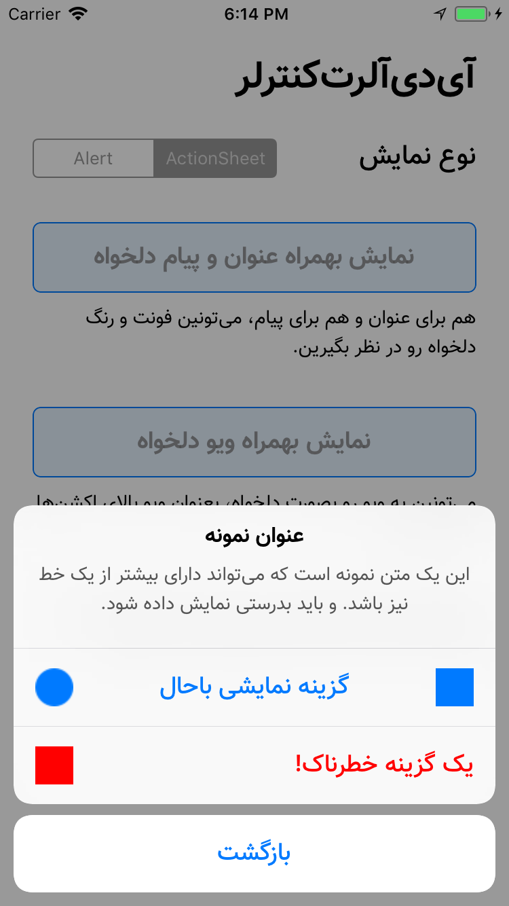
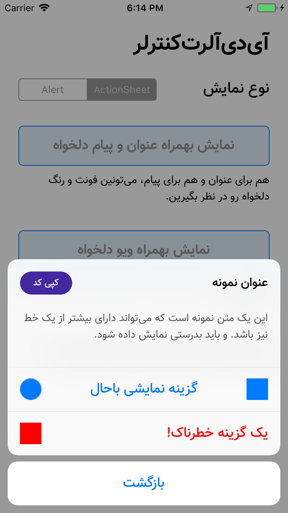
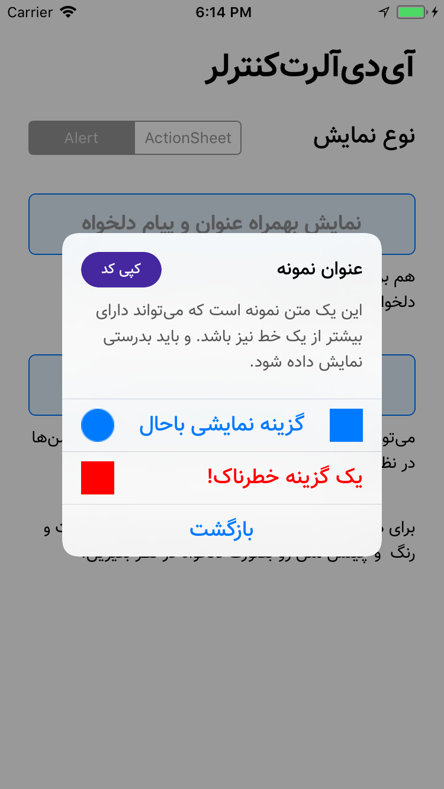

# آی‌دی آلرت ویوکنترلر

## پیش‌نمایش!

<table>
  <tr>
    <td>
      
    </td>
    <td>
      
    </td>
    <td>
      
    </td>
  </tr>
</table>

## مشکل
زمانیکه توی اپ‌های آی‌او‌اس بخواین از `UIAlertViewController` استفاده کنین، این ویوکنترلر از فونت‌های پیشفرض سیستم‌عامل استفاده می‌کنه. با استفاده از یه سری کد، میشه فونت و رنگ عنوان و پیام بالای کنترلر رو تغییر داد.

اما برای گزینه‌ها یا همون `UIAlertAction`ها، رویه مشخصی برای تغییر رنگ یا فونت نوشته‌ها وجود نداره (یا حداقل من پیدا نکردم!). البته اگه `tintColor` خود `alertController` رو تغییر بدین، رنگ همه گزینه‌ها تغییر می‌کنه. اما مشکل اصلی همون فونت هستش.

## راه حل
برای حل این مشکل، یه سری کلاس جدید پیاده‌سازی کردیم و همینطور یه سری کارای مهندسی‌طور کردیم!!😅 اونجوری دیگه نه تنها فونت، که رنگ و چینش و عکس‌های مربوط به هر اکشن رو میشه شخصی‌سازی کرد. 😎

## مدل‌ها و نحوه استفاده‌شون

### مدل `IDAlertAction`
این مدل در واقع مدل مورد نظر ما برای اکشن‌ها (یا همون گزینه‌های آلرت‌کنترلر) هست. 

#### نحوه ساخت
سازنده بصورت زیر هست:

<pre dir='ltr'>
init(title: String, handler: Handler?)
</pre>

این سازنده یه عنوان می‌گیره و یه `closure` که استفاده‌اش مشخصه.

#### متدها
برای شخصی‌سازی اکشن، چندتا متد در نظر گرفته شده.

تغییر چینش، رنگ و فونت اکشن:
<pre dir='ltr'>
setupText(alignment: NSTextAlignment, color: UIColor?, font: UIFont?)
</pre>

تنظیم عکس‌(های) اکشن:
<pre dir='ltr'>
setupImages(leftImage: UIImage?, rightImage: UIImage?)
</pre>

تنظیم حالت اکشن (مثل `default` یا `cancel`) :
<pre dir='ltr'>
setActionStyle(_ actionStyle: UIAlertAction.Style)
</pre>

#### مشخصه‌های کمکی
برای راحتی بیشتر، یه متغیر از نوع `static` در نظر گرفته شده، تا بصورت پیشفرض، اگه فونتی به اکشن اختصاص داده نشده بود، از این مقدار استفاده بشه. شما با یکبار مقداردهی این مشخصه، تمام آلرت‌اکشن‌ها رو با اون فونت مشاهده می‌کنین.

<pre dir='ltr'>
public static var TextFont: UIFont = ...
</pre>

یعنوان مثال می‌تونین مقداردهی این مشخصه رو توی `AppDelegate` انجام بدین.

 

### مدل `IDAlertHeader`
این مدل عنوان و پیام آلرت رو پیکربندی می‌کنه.
استفاده‌اش برای مشخص‌کردن `title` و `message` و همینطور مشخص‌کردن فونت و رنگ هرکدوم هست.

#### نحوه ساخت
سازنده بصورت زیر هست:

<pre dir='ltr'>
init(title: String?, message: String?)
</pre>

اصن نیازی به توضیح هست؟! 🤔

#### متدها
برای شخصی‌سازی هدر دوتا متد در نظر گرفته شده. هر دو رنگ و فونت رو تغییر میدن؛ یکی برای عنوان و یکی هم برای پیام.

<pre dir='ltr'>
setup{Title|Message}(font: UIFont?, color: UIColor?)
</pre>

#### مشخصه‌های کمکی
اینجا هم یه سری مشخصه بصورت `static` در نظر گرفته شدن، تا هربار نیازی نباشه شما فونت و رنگ عنوان و پیام رو مقداردهی کنین.

<pre dir='ltr'>
static var TitleFont: UIFont = .systemFont(ofSize: 16, weight: .bold)
static var TitleColor : UIColor = .black
static var MessageFont : UIFont = .systemFont(ofSize: 14, weight: .regular)
static var MessageColor : UIColor = .darkGray
</pre>

یعنوان مثال می‌تونین مقداردهی این مشخصه‌ها رو هم توی `AppDelegate` انجام بدین.

 

### مدل `IDAlertController`
این مدل همون مدلی هست با استفاده ازش، خود `UIAlertController` نمایش داده میشه.

#### نحوه ساخت
متدی که برای ساخت استفاده میشه، بصورت زیر تعریف شده:

<pre dir='ltr'>
init(header: IDAlertHeader?, actions: [IDAlertAction], preferredStyle style: UIAlertController.Style)
</pre>

همونطور که مشخصه، این سازنده، یه `IDAlertHeader` می‌تونه بگیره. اینکه می‌گم میتونه، به این خاطر هست که این ورودی `Optional` هست و اگه شما آلرتی بخواین نمایش بدین که عنوان و پیام نداره، این ورودی رو `nil` قرار می‌دین.

ورودی دوم میشه اکشن‌های مورد نظر شما؛ که رویه ساخت‌شون رو قبل‌تر توضیح دادم.

ورودی سوم هم مشخص‌کننده نوع نمایش آلرت‌کنترلر هست؛ اینکه بصورت `ActionSheet` باشه یا بصورت `Alert`. 

#### متدها
دوتا متد در دسترس شماست:

متد برای مقداردهی `tintColor` آلرت‌کنترلر:
<pre dir='ltr'>
setTintColor(_ color: UIColor)
</pre>

متد زیر هم برای نمایش آلرت‌کنترلر در iPad کاربرد داره:
<pre dir='ltr'>
setupPopoverPresentationController(
  sourceView: UIView, 
  permittedArrowDirections: UIPopoverArrowDirection
)
</pre>
این متد دوتا ورودی داره. اولی بعنوان ویو (یا المانی) بکار میره که باعث نمایش آلرت‌کنترلر شده. و متد دوم هم برای جهت‌های مجاز نمایش فلش برای آلرت‌کنترلر در آی‌پد بکار میره.

<td>
  <tr>
    <td>
      
    </td>
  </tr>
</td>

## در آخر
اگه توی استفاده به مشکلی برخورد کردین، بگین تا در صورت امکان رفع‌اش کنیم. 🤓

اگه هم از این خوش‌تون اومد، به بقیه هم معرفی‌اش کنین، تا بقیه هم ازش استفاده کنن؛ و اینجوری مجبور نباشیم برای یه آلرت، یا از فونت پیشفرض استفاده کنیم، یا یه کتابخانه دیگه اضافه کنیم.

## دِ اِند. 😎

